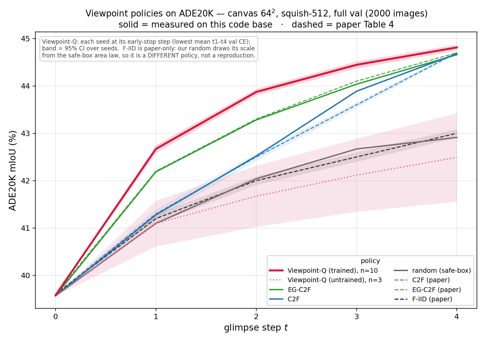

# Verification campaign: exp32–exp35

Four groups of runs that exercise, at full scale, all three training objectives plus the
viewpoint policy. Together they cover every task the trainer supports, on real data, for as
long as a production run — the evidence that the stack works end to end rather than only in
unit tests.

| group | what it trains | runs | judged on | status |
|---|---|---|---|---|
| `exp32_pretrain_lrdrop` | `distill` pretraining from scratch, then an LR decay phase | 4 | `val/scene_cos_raw_t9` | training |
| `exp33_in1k_finetune` | `in1k` full finetunes of four pretrained backbones | 4 | top-1 | training |
| `exp34_ade20k_probe` | `ade20k` frozen segmentation probes on the same four | 4 | CE and mIoU | **complete** |
| `exp35_policy_qreg_10seed` | ADE20K viewpoint policy (Q-regression), 10 seeds | 10 | CE and mIoU | **complete** |

Each group below has the same two sections: **Setup** (what is run and how) and **Results**.

For exp34 and exp35 the results are these runs' own. **exp32 and exp33 are still training,
so instead of reporting partial curves those sections give the results of earlier runs of
the same configuration** — `jon_exp22_full_runs` for pretraining and `exp25` for the IN1k
finetunes — with the differences spelled out. Every borrowed number is labelled with the run
it came from.

## Shared procedure

Every launcher is a small self-documenting script. Submit by running it:

```bash
bash slurm/runs/<group>/<run>.sh
```

Each group also has a `slurm/runs/<group>/README.md` with the per-arm detail: source
checkpoints, job ids, and the traps specific to that group. This document is the overview.

All launchers pin `TRAIN_COMMIT` / `PYTORCH_COMMIT` / `FOVI_COMMIT`, so each job runs a
frozen `git archive` snapshot and is immune to later edits of the clones.

Arrays are a **budget, not a schedule**: the job index comes from the checkpoint's resume
state rather than `SLURM_ARRAY_TASK_ID`, so the step count advances only for jobs that
succeed. If tasks die, resubmit the remainder — nothing is lost and nothing double-counts.
Resubmitting also continues the same wandb run, because the checkpoint carries its run id.

Keep the wall-clock request at or below **2 h**: that lands the job in Grete's `2h` QOS,
which turns around in minutes instead of the ~day a longer request waits for.

---

## exp32 — pretraining with an LR decay phase

### Setup

Four pretrains from scratch: uniform / foveated patcher × with and without teacher init.
Warmup 100k → constant 4e-4, then a single ×0.1 drop to 4e-5 for 204,800 further steps.

**Two phases, because there is no in-run LR-drop feature.** Phase A is `exp32-<arm>.sh`;
phase B is `exp32-<arm>-lrdrop.sh` (flat 4e-5, 25 jobs). The drop point is a FILENAME
(`CFG_SEED_CKPT=.../step-<N>.pt`), so it cannot fire early, late, or twice however many
array tasks fail, and phase B refuses to submit until that file exists.

| arm | phase-A target | drop step | phase B |
|---|---|---|---|
| `exp32-uniform16-teacherinit` | 630,784 | 630,784 | yes |
| `exp32-uniform16` | 1,441,792 | 1,441,792 | yes |
| `exp32-fovi-teacherinit` | 1,130,496 | 1,130,496 | yes |
| `exp32-fovi` | 2,007,040 | — | no |

**Judge on `val/scene_cos_raw_t9`** — the raw scene cosine at the last of 10 eval glimpses.
This is the same scalar the trainer logs as `eval/val_metric` and selects `best.pt` on.

**Evaluation policy** is `auto`, which resolves per patcher: uniform arms validate under
coarse-to-fine, foveated arms under a fixation grid at their training scale (2.0).

### Results

The four arms are still in phase A, so there is nothing final to report here yet.

**Reference: `jon_exp22_full_runs`**, the earlier pretrains of these same four
configurations — and the models exp33 and exp34 actually finetune and probe. Same
architecture, optimizer, LR schedule shape, BPTT and validation set; see *Differences* below
for what is not the same. `val/scene_cos_raw_t9`:

| arm | phase A @4e-4 | decay @4e-5 | 2nd decay @4e-6 | best |
|---|---|---|---|---|
| `uniform16-teacherinit` | 0.9398 @ 638,976 | 0.9477 (+163,840 steps) | 0.9481 (+16,384) | **0.9481** |
| `fovi-teacherinit` | 0.9362 @ 1,196,032 | 0.9423 (+245,760 steps) | — | **0.9423** |
| `uniform16` | 0.9199 @ 1,515,520 | 0.9262 (+368,640 steps) | — | **0.9262** |
| `fovi` | 0.9248 @ 1,941,504 | *no decay phase was run* | — | **0.9248** |

Two things to read off this. **The decay phase is worth +0.006 to +0.008** on every arm that
got one, which is large next to the differences between arms. And **`fovi` never got one**,
so its 0.9248 is a constant-LR number and is not comparable to the other three — the gap
between `fovi` and `fovi-teacherinit` is inflated by the missing decay.

**Differences between exp22 and exp32** — the reason these are reference numbers rather than
targets:

1. **Normalizer statistics.** exp32 pools the first 4 sorted shards; exp22 used a single
   shard (`shard-001751`, 4096 samples). Different standardization of the DINOv3 targets,
   so the loss scale is not identical and the curves do not overlay exactly.
2. **Decay schedule.** exp32 does exactly one ×0.1 drop per arm. exp22's
   `uniform16-teacherinit` got two (4e-5 then 4e-6), and its `fovi` arm got none. exp32's
   uniform-ti arm should therefore be compared against the 0.9477 one-drop figure, not
   0.9481, and its `fovi` arm has no decayed counterpart at all.
3. **Drop steps.** exp22 dropped at 638,976 / 1,196,032 / 1,515,520; exp32 drops at
   630,784 / 1,130,496 / 1,441,792.
4. **Seeding.** The older trainer never called `torch.manual_seed`, so each exp22 run drew
   an unreproducible random init. exp32 seeds before `build_model`.

### Seed-spread runs

`exp32-fovi-teacherinit-s1` … `-s5`: five more runs of the foveated teacher-init config,
identical to `exp32-fovi-teacherinit` in every setting except `CFG_SEED`, 204,800 steps each.

```bash
for s in 1 2 3 4 5; do SEED=$s bash slurm/runs/exp32_pretrain_lrdrop/exp32-fovi-teacherinit-seed.sh; done
```

`CFG_SEED` moves the random init (`torch.manual_seed(seed + rank)` runs before
`build_model`) and the webdataset shard schedule. It does **not** move the normalizer
statistics, which pool the first 4 sorted shards and are identical across seeds. Seed 0 is
`exp32-fovi-teacherinit` itself, so the group yields six samples; the launcher refuses
`SEED=0` to protect that run's directory.

They exist to measure how much a foveated pretrain moves between seeds, which nothing in
this stack had quantified. Compare on `train/full/scene_cos_raw`, which is independent of the
eval-viewpoint convention. Still queued — no results yet.

---

## exp33 — ImageNet-1k full finetunes

### Setup

Four finetunes, one per pretrained backbone; the TPU recipe batch-adapted for one A100.
49 array jobs × 8192 = 401,408 steps each (~20 epochs at batch 64). `n_timesteps=4`, not the
task default of 10. Foveated arms evaluate under `random` with
`--cfg.foveated-scale.fixed-scale 2.0` — coarse-to-fine is uniform-only and out of
distribution for a fixed-scale foveated model.

**Only one number is reported and it is measured at the final timestep** — the classifier
reads the CLS token of the last glimpse only, so there is no per-timestep top-1 series.

**Watch the first logged `train/full/loss`:** it must sit well below `ln(1000) ≈ 6.9`. All
four arms start at 1.74–1.88, confirming the pretrained probe head was fused. A value near
6.9 would mean the finetune began from a random classifier, which is what `CFG_PROBE_REPO`
guards against.

An in1k checkpoint records its own architecture, so a finetuned model — whose backbone
exists nowhere else — loads straight from its `.pt` via `load_classifier`.

### Results

All four arms are early (16k–57k of 401,408 steps), so no final top-1 yet.

**Reference: `exp25`**, the earlier finetunes of the same configuration. The launcher flags
are identical — same `--cfg.model-repo` checkpoints, `--cfg.peak-lr 6.25e-6`,
`--cfg.warmup-steps 100000`, `--cfg.n-timesteps 4`, `--cfg.max-steps 401408`,
`--cfg.label-smoothing 0.1`, `--cfg.grad-clip 1.0`, `--cfg.train-start-full` — and exp25 is
pinned at `8f780ba`, the commit that fuses the pretrained probe head, so its first training
losses (1.57–1.82) confirm it did not start from a random classifier. Best `eval/top1`:

| arm | exp25 result | run length |
|---|---|---|
| `in1k-uni16ti-803k` | **0.84954** | complete, 401,408 |
| `in1k-fovi-ti-1196k` | **0.83692** | *stopped at 327,680* — a floor, not a final value |
| `in1k-uni16-1516k` | **0.83522** | complete, 401,408 |
| `in1k-fovi-1901k` | *not run in exp25* | — |

So exp33 adds the missing `fovi-1901k` arm and takes `fovi-ti` to full length; the other two
are straight repeats on the current code.

The only difference from exp25 is the pinned code (`8f780ba` → `716051a`, `canvit_pretrain`
→ `canvit_train`) and the run/project names.

---

## exp34 — ADE20K frozen probes

### Setup

Four probe runs on the same four backbones. Frozen backbone via the `probe` preset, 40,000
steps, random-view training, `n_timesteps 10`, scene 512, `canvas_grid 32`. Single GPU — the
ADE20K task does not support DDP.

**`resize_mode=squish` for every arm including foveated.** It distorts aspect ratio, so it
is not the right choice for a human-viewing comparison; whichever mode is used must be
reported alongside the number, because it moves the metric materially.

**The per-timestep `eval/miou_t*` are measured under *random* viewpoints, not
coarse-to-fine** — `eval_policy` is `auto`, and ADE20K's resolution is IID random from a
full-scene anchor, matching how the probe trains. ADE20K train-mIoU is deliberately not
logged.

### Results

All four completed. Best `miou_final` under the training eval (random viewpoints,
10 glimpses):

| arm | best `miou_final` |
|---|---|
| `ade20k-uni16ti-803k` | **0.45221** |
| `ade20k-fovi-ti-1196k` | **0.44344** |
| `ade20k-uni16-1516k` | **0.42363** |
| `ade20k-fovi-1901k` | **0.41917** |

#### Re-evaluated under coarse-to-fine, 21 glimpses

The training eval answers "how good is this probe under the viewpoints it trained on". This
answers the separate question "what does it score under the C2F deploy convention", whose
`EpisodeConfig` default is 21 glimpses.

```bash
bash scripts/eval_ade20k_c2f.sh exp34_ade20k_probe        # -> logs/<group>/_c2f_eval/*.json
```

One GPU, ~10 min for all four (measured on a MIG `3g.40gb` A100 slice with 12 CPUs). The
script loops the four arms through `scripts/eval_ade20k_checkpoint.py`, which rebuilds each
model through the ADE20K task and loads the probe's `best.pt` into it — no HF export step.
Full ADE20K val (2000 images), `squish-512`, `canvas_grid 32`, batch 16, each arm against
the backbone its probe was trained on. The two FOVEATED arms add
`--override-scale 2.0 --fixed-scale 2.0`.

mIoU in %, measured 2026-08-02 on each run's `checkpoints/best.pt`:

| arm | t0 | t1 | t2 | t4 | t9 | t14 | t20 | gain t0→t20 | scale pin |
|---|---|---|---|---|---|---|---|---|---|
| `uni16ti-803k` | 41.23 | 42.69 | 43.80 | 45.62 | 46.13 | 46.39 | **46.61** | +5.38 | — |
| `fovi-ti-1196k` | 37.68 | 40.55 | 41.92 | 44.25 | 45.18 | 45.56 | **45.91** | +8.23 | 2.0 |
| `uni16-1516k` | 38.23 | 39.90 | 41.17 | 43.16 | 43.65 | 43.89 | **44.12** | +5.88 | — |
| `fovi-1901k` | 35.26 | 38.49 | 39.87 | 41.84 | 42.28 | 42.89 | **43.03** | +7.77 | 2.0 |

Same ordering as the training eval, and every arm ends 1.1–1.8 pp above its own 10-glimpse
random-view `miou_final`.

**The foveated arms' larger gain is not a larger capability.** Each starts ~3 pp below its
uniform counterpart at t0 and spends the curve catching up, because for a fixed-scale
foveated backbone t0 is a scale-2.0 foveation rather than a full-image view.

**"Coarse-to-fine" is only literally true for the uniform arms.** `--override-scale`
overwrites every generated scale and keeps the generated CENTERS, so the pinned foveated
arms run all 21 glimpses at the identical scale-2.0 foveation pattern, moved along the
quadtree's centre schedule (centre → 4 quadrant centres → 16 sub-quadrant centres). The
{1.0, 0.5, 0.25} scale ladder that makes C2F coarse-to-fine is exactly what the pin deletes.
Unpinned it would be worse, not better: a fixed-scale foveated model derives
`fix_size = scale * H`, so unseen scales put every glimpse out of distribution and mIoU
decays as glimpses accumulate. The four arms are therefore not compared policy-for-policy,
and should be reported that way.

**These numbers carry run-to-run noise.** `policies._shuffle_levels` calls `torch.randperm`
with no generator, so C2F draws a fresh within-level permutation per sample from the global
RNG. Re-evaluating identical weights moved `t20` by up to 0.5 pp on `fovi-1901k` and by
≤0.07 pp on the other three, while `miou_t0` matched to five decimals every time — level 0
has n=1 and skips the shuffle. Seeding the permutation would remove the question; until
then, do not read a sub-pp difference between two c2f runs as real.

---

## exp35 — ADE20K viewpoint policy, 10 seeds

### Setup

A `ViewpointScorer` trained by Q-regression against a **frozen** backbone and probe, so that
segmentation improves as fast as possible per glimpse; at deployment it takes the argmax over
its candidate grid. `--preset policy_only`, 9000 steps, 5 timesteps, batch 16, canvas grid
64, `resize_mode=squish`. Ten seeds.

The frozen backbone needs no flag — `Ade20kConfig.model_repo`'s default is the published c64
pretrain — and `CFG_MODEL_REPO` is deliberately unset, which makes this group independent of
exp32–34.

**9000 steps rather than 8000**, because the loop evaluates when `step % val_every == 0` and
never reaches `max_steps`; at 8000 the last eval would be at 7000. The extra 1000 steps buy a
ninth eval. They do not reshape the LR schedule: `policy_only` freezes backbone and head, so
ADE20K's `warmup_onecycle` is never built. The scorer uses `JointPolicyConfig`'s own recipe —
`warmup_constant`, warmup = `int(0.125 * max_steps)`, then flat at 2e-4 — so the only effect
is a ramp to step 1125 instead of 1000.

`CFG_RESIZE_MODE=squish` is the measurement contract for this group. Changing it shifts CE by
roughly 0.016 — an order of magnitude more than the seed spread below — so a policy result
that looks dramatically better is far more likely to be a changed protocol than a better
policy.

**Free consistency check:** `ce_t0` / `miou_t0` are the glimpse taken *before* any policy
action, so they depend only on the frozen backbone, probe, resize and eval path. Matching
them against a probe-only evaluation isolates any difference to the policy itself.

### Results

All ten seeds complete. Each at its early-stop step: the eval with the lowest mean t1–t4 CE,
which is what `Ade20kRunTask.best_metric` selects `best.pt` on.

| seed | early-stop step | best `ce_mean` | `miou_final` (%) |
|---|---|---|---|
| s0 | 7000 | 0.68634 | 44.99 |
| s1 | 6000 | 0.68561 | 44.87 |
| s2 | 3000 | 0.68584 | 44.88 |
| s3 | 3000 | 0.68586 | 44.69 |
| s4 | 7000 | 0.68712 | 44.84 |
| s5 | 6000 | 0.68553 | 44.77 |
| s6 | 7000 | 0.68579 | 44.85 |
| s7 | 6000 | 0.68703 | 44.65 |
| s8 | 6000 | 0.68602 | 44.84 |
| s9 | 8000 | 0.68580 | 44.74 |
| **mean ± sd** | | **0.68609 ± 0.00056** | **44.81 ± 0.10** |

Ten seeds span 0.00159 in CE and 0.34 pp in mIoU — that spread is the resolution of this
recipe, and any two policy configurations closer together than it are not distinguishable
without more seeds. One seed (s9) early-stopped at step 8000, on the ninth eval that the
9000-step length exists to provide.

#### Policy comparison figure



```bash
# measure the baselines on a GPU, read the trained-Q seeds from the run logs, then draw
python scripts/plot_policy_comparison.py --trained-dir logs/exp35_policy_qreg_10seed

# baselines depend only on the frozen model + data + metric code, so a new policy group
# can copy them instead of re-measuring (no GPU, seconds)
python scripts/plot_policy_comparison.py --trained-dir logs/exp35_policy_qreg_10seed \
    --reuse-baselines readme_docs/assets/_policy_comparison_data.json

python scripts/plot_policy_comparison.py --from-cache    # re-style only, no measurement
```

Writes `readme_docs/assets/ComparisonPoliciesADE20K.png` and caches every curve to
`readme_docs/assets/_policy_comparison_data.json`, so restyling costs no GPU.

Every curve shares one frozen model — the published c64 pretrain plus
`canvit/probe-ade20k-40k-s512-c64-in21k`, canvas 64, squish-512, 5 glimpses, full val. Only
the viewpoint policy differs, and it is the same pair exp35 trains against, so the learned
curve and the baselines are strictly comparable.

mIoU in %, t = 0..4:

| policy | t0 | t1 | t2 | t3 | t4 |
|---|---|---|---|---|---|
| **Viewpoint-Q (trained), n=10** | 39.58 | **42.67** | **43.87** | **44.44** | **44.81** |
| 95% CI over seeds | — | ±0.08 | ±0.07 | ±0.07 | ±0.06 |
| EG-C2F | 39.57 | 42.19 | 43.28 | 44.04 | 44.66 |
| C2F | 39.57 | 41.28 | 42.52 | 43.89 | 44.68 |
| random (safe-box) | 39.57 | 41.10 | 42.04 | 42.67 | 42.91 |
| Viewpoint-Q (untrained), n=3 | 39.57 | 41.10 | 41.67 | 42.12 | 42.49 |

The learned policy leads at every t, and its advantage is largest early — +1.4 pp over C2F at
t1, narrowing to +0.1 pp by t4. That is the claim being tested: it should reach a given mIoU
in fewer glimpses, not necessarily end higher. The untrained-scorer row is the control that
separates "the learned policy works" from "any argmax trajectory works".

**Two things a reader gets wrong about this figure.** The dashed F-IID row is drawn from the
paper only: our `random` draws its scale from the safe-box area law rather than F-IID's fixed
fovea-sized scale, so it is a different policy plotted under its own name, not a
reproduction. And the trained curve's t0 (39.58) sits 0.01 pp above the baselines' (39.57)
even though t0 is pre-policy and the model is identical — the trained row is read from each
run's own logged eval, in a different process from the one-shot baseline measurement. That is
cross-process numerical noise, not a different model.

---

## Using the results afterwards

Checkpoints from exp33 and exp34 are **self-describing**: they record the architecture, not
just a path to the model they started from, so they load without their source repo:

```python
from canvit_pytorch.model_source import load_classifier, load_segmentation
clf = load_classifier("logs/exp33_in1k_finetune/<run>/checkpoints/best.pt")
seg = load_segmentation("logs/exp34_ade20k_probe/<run>/checkpoints/best.pt")
```

An exp34 checkpoint also works directly as `--cfg.probe-repo` for a policy run, with no
conversion. Publishing goes through `canvit_train.checkpoint.to_hf` (whole models) or
`canvit_train.checkpoint.probe_to_hf` (the segmentation head alone).

exp32's pretraining checkpoints always carried their full architecture, which is why `to_hf`
accepts them and refuses the others.
